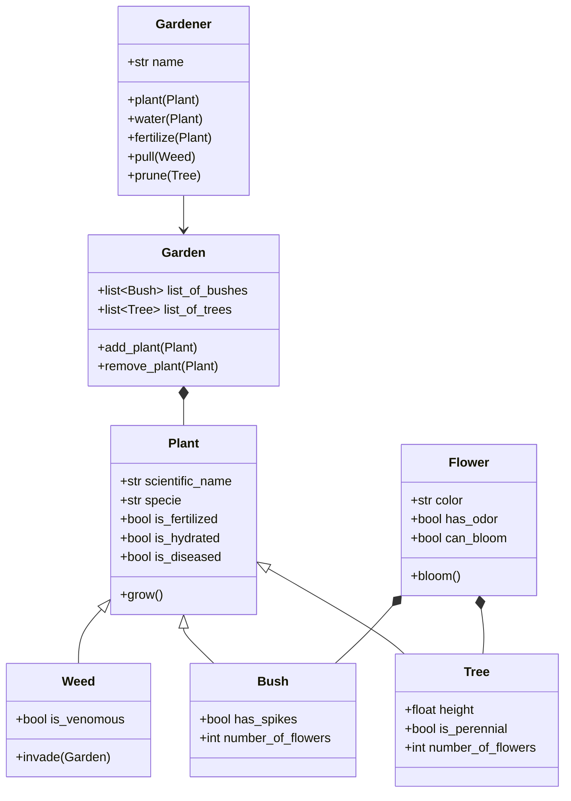

# POO_Reto_2

Here we intend to model a garden with the OOP method.

The gardener is in charge of most of the interactions with the plants in the garden, such as water, fertilize or even pull them. Here, the classes weed, bush and tree are all a kind of plant, and therefore inherit its methods. Weed isn't recognized as a member of the garden per se. The bushes and trees are meant to have flowers in order to be in the garden, and each flower has an specific time of the year to bloom.
